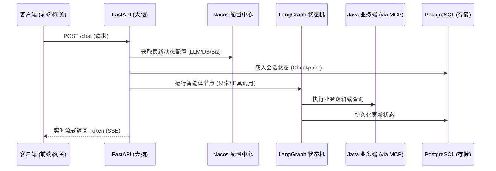
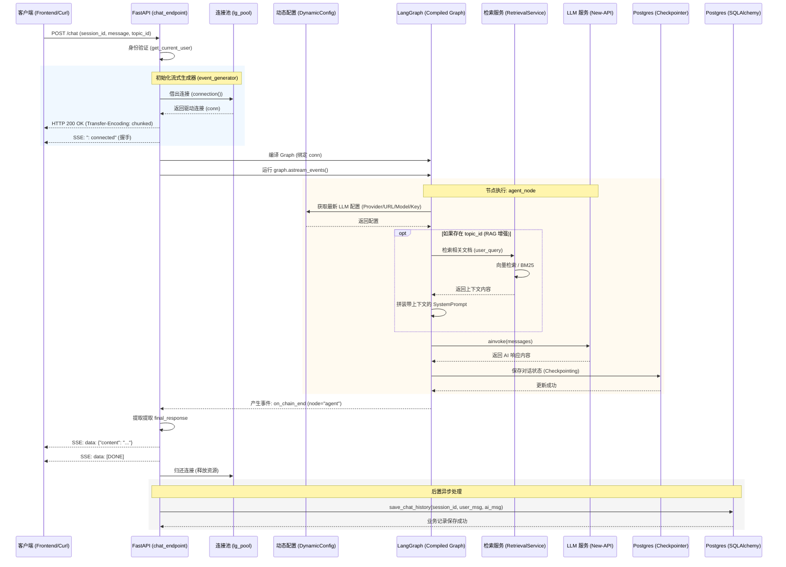

# 🧠 Python Agent (系统“大脑”)

[](https://www.python.org/downloads/)
[](https://fastapi.tiangolo.com/)
[](https://langchain-ai.github.io/langgraph/)
[](https://opensource.org/licenses/MIT)

本项目是 AI 系统中的核心**“大脑” (Brain)**。基于 **FastAPI** 和 **LangGraph** 构建，负责编排复杂的智能体工作流、维护基于 PostgreSQL 的长期记忆，并通过 **Model Context Protocol (MCP)** 协议与 Java 业务后端及外部工具进行深度交互。

---

## 🌟 核心特性

- **智能体编排 (Agentic Orchestration)**：利用 **LangGraph** 实现有状态的多节点 AI 推理与决策闭环。
- **动态配置**：通过 **Nacos** 实现 LLM 参数、数据库连接及业务配置的热更新。
- **MCP 生态集成**：
    - **Stdio 模式**：调用本地工具（如 Brave Search）。
    - **SSE 模式**：通过 Server-Sent Events 调用 Java 后端或远程服务。
- **微服务接入**：完美集成 Nacos 服务发现，实现跨语言服务互访。
- **流式响应**：支持 SSE 实时 Token 流输出，提供极致的用户对话体验。

---

## 🚀 快速开始 (使用 `uv`)

推荐使用高性能 Python 包管理器 [uv](https://github.com/astral-sh/uv)。
### 1. 安装依赖

```bash
# 克隆仓库
git clone <repository_url>
cd python-agent

# 安装依赖并创建虚拟环境 (uv 会自动处理)
uv sync
```

### 2. 配置说明

本项目采用 **Nacos 集中化配置**，环境引导通过环境变量完成。

#### A. 环境引导 (Bootstrap)
在当前目录设置环境变量或创建 `.env` 文件（生产环境建议通过环境变量注入）：

```bash
# Nacos 基础连接配置
NACOS_SERVER_ADDR=127.0.0.1:8848
NACOS_NAMESPACE=your-namespace-id
NACOS_USERNAME=nacos
NACOS_PASSWORD=your-password

# 应用基础信息
APP_ENV=development      # 影响加载的 Nacos Config Data ID
SERVICE_NAME=python-agent
```

#### B. Nacos 配置详情
将配置模板上传至您的 Nacos 服务器：
- **配置文件路径**：如果没有nacos 则新建本地路径：`nacos-data/snapshot/nacos-config-example.yaml`
- **Data ID**：`python-agent-development.yaml` (根据 `APP_ENV` 调整)
- **Group**：`DEFAULT_GROUP`

> [!IMPORTANT]
> 该 YAML 文件包含数据库凭据、LLM API Key 等敏感信息，请确保 Nacos 权限安全。

### 3. 运行服务

```bash
# 启动 FastAPI 服务（开发模式支持热重载）
uv run main.py
```

服务默认运行在：`http://127.0.0.1:8181`

---

## 📖 接口与文档

- **交互式文档 (Swagger UI)**：[http://127.0.0.1:8181/docs](http://127.0.0.1:8181/docs)
- **健康检查**：`GET /health`
- **对话接口**：`POST /chat`

```json
{
  "message": "你好，能帮我分析一下最新的 AI 趋势吗？",
  "session_id": "可选-会话ID",
  "topic_id": "可选-知识库ID"
}
```

---

## 🏗️ 架构与工作流

“大脑”采用了严格的异步流式事件驱动架构：



### 核心设计点

1. **连接隔离**：手动管理 `psycopg` 连接池，确保 LangGraph 状态持久化的稳定性。
2. **握手心跳**：SSE 立即返回 `: connected`，避免 Nginx 等代理服务处理慢 AI 时发生超时。
3. **动态 RAG**：根据 `topic_id` 实时检索知识库并动态拼装上下文。
4. **后置持久化**：AI 输出结束后，异步完成业务对话历史的存储，不阻塞用户感知。

---

## 📁 项目结构

```text
ms-py-agent/
├── app/
│   ├── api/            # API 路由与 HTTP 入口
│   ├── core/           # 核心基础设施 (Nacos, DB, 线程生命周期管理)
│   ├── domain/         # 领域层：纯 Pydantic/dataclass 领域实体定义 (无 ORM 侵入)
│   ├── infrastructure/ # 基础设施层：外部客户端及数据库/向量库的具体实现
│   ├── services/       # 服务整合层：包含 MCP 客户端、多语言 i18n 引擎等
│   └── agent/          # LangGraph 核心智能图编排
│       ├── router/     # 全局智能路由图与意图分类决策节点
│       ├── subgraphs/  # 垂直领域子图 (RAG、Coding、General、A2A)
│       ├── factory.py  # 智能体编译及构建工厂类
│       ├── graph.py    # 编译完成的生产级图流
│       └── state.py    # 包含子图的全局隔离状态定义
├── configs/            # 配置模板 (Nacos YAML 样例)
├── scripts/            # 运维及数据预处理脚本
├── main.py             # 应用入口
├── pyproject.toml      # UV 项目定义
└── ...
```

---

## 🛡️ 开发规范

- **异步优先**：必须使用 `async def` 和 `await`。网络请求统一使用 `httpx`。
- **动态发现**：禁止硬编码服务地址，必须通过 Nacos 动态发现 Java 等下游服务。
- **状态一致性**：所有 AI 决策路径必须在 LangGraph 中有清晰的状态流转记录。


### Chat Endpoint 详细执行流程分析

下面是 `/rest/dark/v1/agent/chat` 接口在一次完整请求中的时序图。
为什么流程看起来很复杂？
连接隔离：为了保证 AI 状态持久化（Checkpointer）的鲁棒性，我们避开了常规的 SQLAlchemy，直接使用了底层的 psycopg 连接池。
异步流式解耦：为了让 AI 结果能“崩”出一个个字（或一段段话），代码必须处理复杂的事件循环，而不是简单的 return response。
多阶段执行：在 AI 说话之前，系统其实已经在后台默默完成了“查配置、查知识库、存状态、准备环境”等一系列动作。

chat_endpoint 看起来复杂，是因为它不仅仅是一个简单的“提问-回答”接口，而是一个集成了状态管理（Memory）、知识库检索（RAG）、流式响应（SSE）以及动态配置的复杂工作流系统。

以下是这个过程的详细拆解，以及为什么要这么设计：

1. 核心流程拆解
当你请求这个接口时，后台完整经历了以下 7 个阶段：

建立受控连接 (Connection Management)

动作：从专门的连接池 (lg_pool) 申请一个数据库连接。
原因：LangGraph 需要在数据库中实时读写聊天进度（Checkpoint）。我们手动管理连接是为了确保在流式输出的整个过程中，数据库连接是稳定且独占的，防止写状态时中断。
握手与心跳 (Handshake)

动作：立即 Yield 一个 : connected。
原因：由于 AI 响应可能很慢，这个“握手”能告诉前端（和服务端代理如 Nginx）：连接已连通，不要因为超时而切断请求。
编排“大脑” (Graph Compilation)

动作：根据当前连接初始化 StateGraph。
原因：系统使用的是 LangGraph，它允许我们将 AI 逻辑拆分成多个节点。即使是简单的对话，它也涉及“判断当前状态 -> 载入历史记录”的步骤。
动态 RAG 检索 (Retrieval-Augmented Generation)

动作：在 AI 思考前，如果带了 topic_id，它会去向量数据库检索相关知识。
原因：由于支持可配置的知识库，它会在 node 内部根据 topic_id 自动拼装上下文。
异步事件流 (Event Streaming)

动作：调用 astream_events 并迭代所有内部事件。
原因：AI 的运行分为“开始思考”、“检索中”、“调用 LLM”、“生成结果”等多个微小事件。我们在这里只过滤出 "agent" 节点的 on_chain_end 事件（即最终结果）发给前端。
事务回滚与归还连接

动作：async with 结束，自动释放连接。
原因：确保资源不泄露。
异步持久化历史记录 (History Save)

动作：在给用户发完数据后，单独开启一个 SQLAlchemy 事务，把对话存入业务表。
原因：解耦。保存历史记录不应该阻塞 AI 的输出，所以我们在流结束后异步完成。


